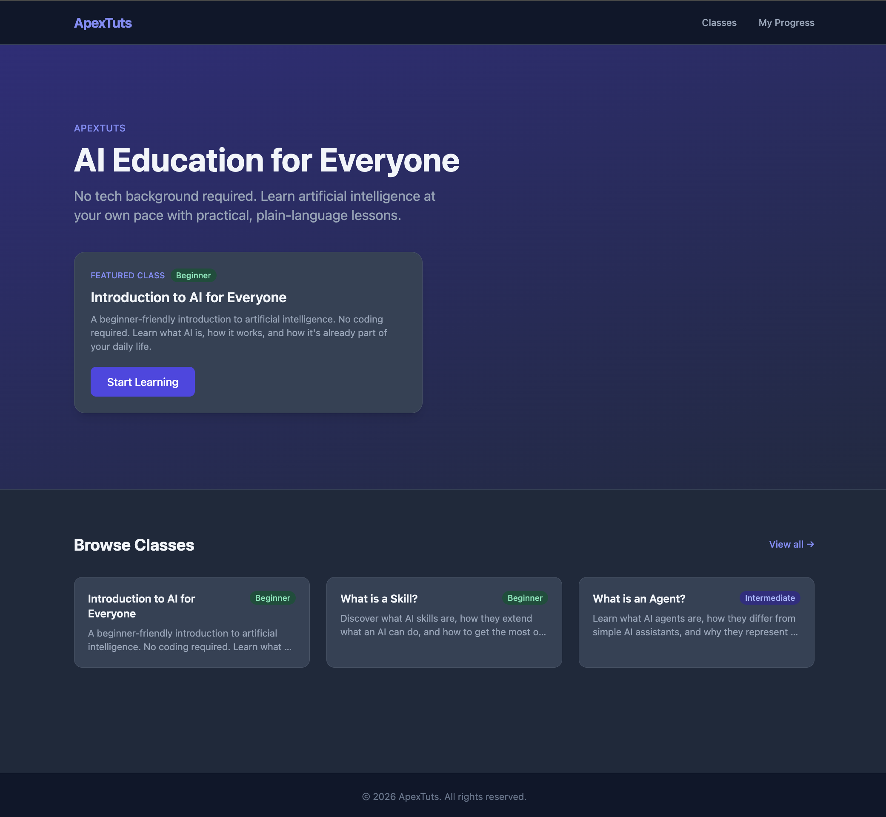

# ApexTuts

A web platform for ApexTuts — a company that creates AI tutorials and classes for non-technical learners. Students can discover courses, work through lessons at their own pace, and track their progress — no account required.

---

## What the Application Does

ApexTuts gives students a place to:

- **Browse a class catalog** — view all available AI courses with difficulty levels and lesson counts
- **Start a class instantly** — one click enrolls an anonymous session and drops the student into lesson 1
- **Read lessons** — markdown-rendered lesson content with prev/next navigation
- **Mark lessons complete** — explicit "Mark as Complete" button tracks progress per lesson
- **See overall progress** — a dedicated dashboard shows all enrolled classes with completion percentages

There is no login. Student progress is stored in `localStorage` keyed to an anonymous UUID generated on first visit. The backend serves a read-only class and lesson catalog from a SQLite database.



---

## Tech Stack

| Layer | Technology |
|---|---|
| Frontend | Vite + React + TypeScript |
| Styling | TailwindCSS (dark slate + indigo palette) |
| State management | Zustand with `persist` middleware |
| Routing | React Router v6 |
| Markdown rendering | react-markdown + remark-gfm |
| Backend | Node.js + Express |
| Database | SQLite via better-sqlite3 |
| Testing | Vitest + React Testing Library + Supertest |

---

## How to Run

```bash
# 1. Install dependencies
npm install
npm install --prefix client
npm install --prefix server

# 2. Seed the database with the starter class
npm run seed

# 3. Start both servers concurrently
npm run dev
```

- Frontend: `http://localhost:5173`
- API: `http://localhost:3001`

### Other commands

```bash
npm test              # run all tests (client + server)
npm run test:client   # client tests only
npm run test:server   # server tests only
npm run build         # production build of the frontend
```

---

## How This Was Built — The AI-Assisted Workflow

This project was planned, designed, and implemented entirely using Claude Code with three specialized skills. No code was written before the design was fully resolved. No design was committed before the idea was stress-tested. The workflow is deliberately sequential — each phase produces artifacts that are the required input for the next.

```
 ┌─────────────────────────────────────────────────────────────────────┐
 │                        AI WORKFLOW PIPELINE                         │
 └─────────────────────────────────────────────────────────────────────┘

   ┌──────────────┐
   │   idea.md    │  ← plain English description of the product concept
   └──────┬───────┘
          │
          ▼
   ┌──────────────────────────────────────────────────────┐
   │  PHASE 1 — /grill-me                                 │
   │                                                      │
   │  Purpose: Resolve every ambiguous design decision    │
   │  before any spec is written.                         │
   │                                                      │
   │  Input:   idea.md                                    │
   │  Output:  planning/grill-me-2026-05-09.md            │
   │           (15 decisions + data model + open Qs)      │
   └──────────────────────┬───────────────────────────────┘
                          │
                          ▼
   ┌──────────────────────────────────────────────────────┐
   │  PHASE 2 — /create-prd                               │
   │                                                      │
   │  Purpose: Turn resolved decisions into a formal      │
   │  PRD and actionable, testable stories.               │
   │                                                      │
   │  Input:   grill-me-2026-05-09.md                     │
   │  Output:  planning/PRD-2026-05-09.md                 │
   │           planning/stories/story-001.md … 010.md     │
   └──────────────────────┬───────────────────────────────┘
                          │
                          ▼
   ┌──────────────────────────────────────────────────────┐
   │  PHASE 3 — /implement-stories                        │
   │                                                      │
   │  Purpose: Build the application story by story       │
   │  using TDD — tests written alongside code,           │
   │  each story marked done only when tests pass.        │
   │                                                      │
   │  Input:   planning/stories/*.md                      │
   │  Output:  Full working application                   │
   │           30 passing tests, 0 TypeScript errors      │
   └──────────────────────────────────────────────────────┘

          ↑ Initial MVP build ends here.
          After launch, new features follow a shorter loop:

   ┌──────────────────────────────────────────────────────┐
   │  ITERATIVE LOOP — /write-story → /implement-stories  │
   │                                                      │
   │  Purpose: Capture new feature requests as proper     │
   │  stories with acceptance criteria, then implement    │
   │  them the same disciplined way as the initial MVP.   │
   │                                                      │
   │  Input:   Natural language feature request           │
   │  Output:  planning/stories/story-NNN.md  (previewed, │
   │           confirmed by user, saved)                  │
   │           ↓                                          │
   │           Implemented via /implement-stories         │
   │           with TDD, marked done on green tests       │
   └──────────────────────────────────────────────────────┘
```

---

### Phase 1 — `/grill-me` — Stress-Testing the Idea

The `/grill-me` skill acts as a relentless interviewer. It works through the idea branch by branch, resolving dependencies between decisions one at a time. For every question it offers a recommended answer with trade-offs, then locks in the answer before moving to the next question. Nothing is left vague.

**Why use it first?** Design decisions made under pressure during implementation are expensive to reverse. Resolving identity, storage, registration flow, and content format *before* writing a spec prevents scope creep and dead ends.

#### The 15 Questions — and What Was Decided

```
 Q01  What should a first-time visitor do on the homepage?
      Options:  Browse catalog | Learn about company | See featured class
      Decided:  See featured class ← hero with strong CTA

 Q02  Without auth, how does the app track WHO is taking a class?
      Options:  Anonymous localStorage UUID | Guest name/email | Skip tracking
      Decided:  Anonymous localStorage UUID ← zero friction, acceptable for MVP

 Q03  What does a "class" contain?
      Options:  Lessons (ordered) | Modules → Lessons | Single long page
      Decided:  Lessons (ordered) ← Class has many Lessons, progress per lesson

 Q04  Where does video content live?
      Options:  YouTube/Vimeo embeds | Self-hosted | No video for now
      Decided:  No video ← text/markdown only; simplifies lesson viewer

 Q05  What does "Register" mean without auth?
      Options:  Start immediately | Collect email | Placeholder only
      Decided:  Start immediately ← writes to localStorage, navigates to lesson 1

 Q06  What counts as a completed lesson?
      Options:  Manual "Mark as Complete" | Auto-scroll detection | End-of-lesson quiz
      Decided:  Manual "Mark as Complete" ← explicit, unambiguous, easiest to build

 Q07  Where is progress stored?
      Options:  localStorage only | localStorage + SQLite sync | SQLite only
      Decided:  localStorage only ← SQLite becomes catalog-only; no backend writes needed

 Q08  How does content get into the database?
      Options:  Seed script | Simple admin page | JSON file
      Decided:  Seed script ← no admin UI for MVP, developer-controlled

 Q09  How does React talk to SQLite?
      Options:  Express + better-sqlite3 | SQLite WASM in browser | Hono/Fastify
      Decided:  Express + better-sqlite3 ← standard, testable, Vite proxy in dev

 Q10  Which routes are in scope for MVP?
      Selected: /  |  /classes  |  /classes/:id  |  /classes/:id/lessons/:lessonId
      (all four core routes confirmed)

 Q11  Should there be a "My Progress" page?
      Options:  Yes — /progress reads localStorage | Inline on class detail | Defer
      Decided:  Yes — /progress page ← adds 5th route, zero backend needed

 Q12  What is the visual design direction?
      Options:  Clean white + accent | Dark mode | Soft neutral earthy tones
      Decided:  Soft neutral ← warm off-white + earthy (stone/amber Tailwind palette)
      Updated:  Post-MVP STORY-012 replaced stone/amber with dark slate + indigo
                for a more professional look (see Iterative Phases below)

 Q13  How is lesson content authored and stored?
      Options:  Markdown as TEXT in SQLite | HTML | Structured JSON blocks
      Decided:  Markdown TEXT ← rendered via react-markdown, simple to seed

 Q14  What does each class card show in the catalog?
      Options:  Title + description only | With thumbnail | With metadata
      Decided:  Title + short description + lesson count + difficulty badge

 Q15  What is the definition of done for the MVP?
      Options:  1 class 3+ lessons all routes working | Catalog only | All UI dummy content
      Decided:  1 real class, 3+ real lessons, all 5 routes functional end-to-end
```

#### Artifacts Produced by `/grill-me`

```
 planning/grill-me-2026-05-09.md
 ├── 15 Q&A decisions with implications
 ├── Architecture summary
 │     Frontend:  Vite + React + TS + TailwindCSS + Zustand + React Router
 │     Backend:   Express + better-sqlite3
 │     Database:  SQLite (catalog only)
 │     State:     localStorage (all student progress)
 │     Auth:      None (MVP)
 ├── Inferred data model (SQL CREATE TABLE statements)
 ├── Inferred localStorage schema (JSON shape)
 ├── Route → Component → Data source mapping
 └── Open questions for post-MVP phases
```

---

### Phase 2 — `/create-prd` — Formalising the Requirements

With every design decision locked in, the `/create-prd` skill converts the grill-me output into two types of artifacts: a product requirements document for shared team context, and individual story files that are the direct input to the implementation phase.

**Why use it second?** The PRD is the contract between planning and code. Stories written *before* coding — with explicit acceptance criteria, definitions of done, and AI implementation notes — mean the implementation phase can run without stopping to clarify scope.

#### PRD Structure (`planning/PRD-2026-05-09.md`)

```
 PRD-2026-05-09.md
 │
 ├── 1. Project Specifics
 │       Status: Planning | Target: MVP
 │
 ├── 2. Team Goals & Business Objectives
 │       Goal 1: Visitors can discover and start classes with zero friction
 │       Goal 2: Progress tracked per lesson across sessions
 │       Success: all 5 routes working + 1 real class seeded
 │
 ├── 3. Background & Strategic Fit
 │       Why now: content exists but there's no web presence
 │       Strategic: foundation for auth, payments, certificates later
 │
 ├── 4. Assumptions & Risks
 │       localStorage durability | markdown content quality
 │       no admin UI bottleneck | single featured class is enough
 │
 ├── 5. User Story Index  ──────────────────────────── 10 stories
 │
 ├── 6. User Interaction & Design
 │       Full user flow diagram
 │       Tailwind design token table (stone-50 bg, amber-600 accent, etc.)
 │       UX constraints (no auth, loading states, empty states)
 │
 ├── 7. Open Questions
 │       Who writes the first real class content?
 │       SEO / SSR requirements before launch?
 │       Hosting environment for Express?
 │
 └── 8. Out of Scope
         Auth | Video | Admin UI | Payments | Quizzes
         Certificates | Filtering | Search | Dark mode | i18n
```

#### Story Dependency Graph

Each story is an independent file. The `/implement-stories` skill uses the dependency graph to determine build order.

```
  STORY-001  Project Scaffold
      │
      ├──────────────────────────┐
      ▼                          ▼
  STORY-002  DB Schema       STORY-004  Progress Store (Zustand)
      │                          │
      ▼                          │
  STORY-003  REST API            │
      │                          │
      └──────────┬───────────────┘
                 │
                 ▼
            STORY-010  Layout / Navbar / Footer
                 │
                 ├─────────────────────────────────────┐
                 ▼                                     ▼
            STORY-005  Homepage              STORY-006  Catalog Page
                                                        │
                                                        ▼
                                             STORY-007  Class Detail
                                                        │
                                                        ▼
                                             STORY-008  Lesson Viewer
                                                        │           │
                                                        ▼           ▼
                                             STORY-009  Progress  STORY-011
                                             Dashboard   Mark as Complete
                                                                   Button State
                                                                    │
                                                              STORY-012
                                                              Dark Theme
                                                       (depends on 001–010)
```

#### What Each Story Contains

Every story file follows the same structure so the implementation skill always has what it needs:

```
 story-00X.md
 ├── id, title, status (todo → done), type (AFK = fully autonomous)
 ├── User Story    "As a [user] I want [X] so that [Y]"
 ├── Acceptance Criteria   (checkbox list — each maps to a test)
 ├── Definition of Done    (observable end state)
 ├── Dependencies          (which other stories must be done first)
 └── AI Notes              (data shapes, component names, package names,
                            CSS classes, edge cases, implementation hints)
```

Example of AI Notes from STORY-003 (Catalog API):

```
 Response shapes:
   GET /api/classes      → [{ id, title, description, difficulty,
                              is_featured, lesson_count }]
   GET /api/classes/:id  → { ...class, lessons: [{ id, title, order_idx }] }
                           NOTE: lesson list must NOT include content field
   GET /api/lessons/:id  → { id, class_id, title, content, order_idx }

 Use better-sqlite3 prepared statements.
 Add cors({ origin: 'http://localhost:5173' }) middleware.
 Return 404 + { error: "Not found" } for missing resources.
```

---

### Phase 3 — `/implement-stories` — TDD Build

The `/implement-stories` skill reads every story file in `planning/stories/`, resolves the dependency graph, and implements each story in order. It follows TDD: tests are written alongside implementation code, and a story is only marked `done` once all its tests pass.

**Principles applied:** SOLID · DRY · KISS · 12-Factor App

#### Implementation Order & What Was Built

```
 ROUND 1 — Infrastructure (no dependencies)
 ──────────────────────────────────────────
  STORY-001  Scaffold
             ├── client/  (Vite + React + TS)
             ├── server/  (Express + ESM)
             ├── root package.json  (concurrently dev script)
             ├── tailwind.config.js  (stone/amber palette)
             └── vite.config.ts  (/api proxy → :3001)

 ROUND 2 — Data layer (depends on 001)
 ──────────────────────────────────────────
  STORY-002  DB Schema & Seed
             ├── server/db/init.js     createSchema(db) + getDb()
             └── server/db/seed.js     3 real AI lessons seeded

  STORY-003  REST API  (depends on 001 + 002)
             ├── server/app.js         createApp(db) factory  ← testable
             └── server/routes/classes.js
                   GET /api/classes
                   GET /api/classes?featured=1
                   GET /api/classes/:id      (with lessons array)
                   GET /api/lessons/:id

  STORY-004  Progress Store  (depends on 001, parallel with 003)
             └── client/src/store/useProgressStore.ts
                   enroll(classId)
                   completeLesson(classId, lessonId)
                   getClassProgress(classId, totalLessons)
                   getAllProgress()
                   persisted via Zustand persist middleware

 ROUND 3 — UI shell (depends on 001)
 ──────────────────────────────────────────
  STORY-010  Layout & Nav
             ├── components/Layout.tsx     Outlet wrapper
             ├── components/Navbar.tsx     active links + hamburger
             └── components/Footer.tsx

 ROUND 4 — Pages (depend on 003 + 004 + 010)
 ──────────────────────────────────────────
  STORY-005  HomePage
             └── Hero section + featured class card + Browse grid

  STORY-006  ClassCatalog
             └── Responsive grid + loading skeletons + progress badges

  STORY-007  ClassDetail
             └── Lesson list + Start/Continue button + checkmarks

  STORY-008  LessonViewer
             └── react-markdown + Mark Complete + prev/next + sidebar

  STORY-009  ProgressDashboard
             └── Progress bars + Continue links + empty state
```

#### TDD Loop (applied to every story)

```
 ┌─────────────────────────────────────────────────────┐
 │  For each story:                                    │
 │                                                     │
 │   1. Read acceptance criteria                       │
 │      (each checkbox → one test case)                │
 │            │                                        │
 │            ▼                                        │
 │   2. Write tests first                              │
 │      (vitest / RTL / supertest)                     │
 │            │                                        │
 │            ▼                                        │
 │   3. Run tests → RED (expected — nothing built yet) │
 │            │                                        │
 │            ▼                                        │
 │   4. Write implementation                           │
 │            │                                        │
 │            ▼                                        │
 │   5. Run tests → GREEN                              │
 │      If still RED → fix → re-run                    │
 │            │                                        │
 │            ▼                                        │
 │   6. Mark story status: todo → done                 │
 └─────────────────────────────────────────────────────┘
```

#### Test Suite Breakdown

```
 server/__tests__/api.test.js          7 tests
 ├── Uses in-memory SQLite (:memory:) — no file I/O, fully isolated
 ├── createApp(db) factory pattern enables DB injection
 └── Tests: health · classes list · featured · class detail ·
            404 class · lesson detail · 404 lesson

 client/src/__tests__/
 ├── useProgressStore.test.ts          9 tests
 │   └── enroll · idempotency · completeLesson · getClassProgress ·
 │       completionPct · auto-complete · getAllProgress
 ├── ClassCard.test.tsx                7 tests
 │   └── renders · links · progress states · completion badge
 ├── DifficultyBadge.test.tsx          3 tests
 └── ProgressBar.test.tsx              4 tests
     └── aria attributes · clamping · percentage display

 TOTAL (after MVP): 30 tests · 30 passing · 0 TypeScript errors
 TOTAL (after STORY-011/012): 38 tests · 38 passing · 0 TypeScript errors
```

---

### Iterative Phases — `/write-story` + `/implement-stories`

After the MVP shipped, new features were added using a tighter loop. Instead of going through the full grill-me → PRD cycle, individual feature requests are captured with `/write-story` and then implemented immediately with `/implement-stories`.

**Why use `/write-story` for post-MVP features?** It enforces the same INVEST criteria and acceptance-criteria discipline as the original stories — the implementation phase still has every piece of information it needs to work autonomously — without the overhead of a full PRD session for a single focused change.

#### `/write-story` — Drafting a Story from a Plain English Request

The skill interviews the user if any detail is ambiguous, then previews the full story for approval before saving it. The output is an INVEST-format story file in `planning/stories/` with all the same fields as the PRD-generated stories.

```
 User says:   "I want the Mark as Complete button to become disabled
               with a green background and checkmark when clicked."

 /write-story →  Previews story-011-mark-complete-button-state.md
                 User approves → file saved

 /implement-stories → RED tests → implementation → GREEN tests
                   → story-011 status: done
```

```
 User says:   "Change the theme to use indigo and darker colors
               to look professional."

 /write-story →  Previews story-012-dark-indigo-theme.md
                 User approves → file saved

 /implement-stories → Updates 14 files across client
                   → All 38 tests pass
                   → story-012 status: done
```

#### Stories Added Post-MVP

```
  (STORY-001 … 010  — initial MVP, see above)
       │
       ├──────────────────────────────────────────────────┐
       ▼                                                  ▼
  STORY-011  Mark as Complete Button State         STORY-012  Dark Theme
  ─────────────────────────────────────────        ────────────────────────────────────
  Button disabled on click                         slate-800 page background
  Green background (bg-green-500)                  slate-700 cards
  Checkmark visible (text-green-900)               slate-600 borders
  Text changes to "Completed"                      indigo-600 primary actions
  Pre-completed state on page load                 indigo-400 links / accent
  8 new tests in LessonViewer.test.tsx             prose-invert for markdown
                                                   Dark difficulty badges
                                                   14 files updated
```

#### Updated Test Suite After Post-MVP Stories

```
 server/__tests__/api.test.js          7 tests   (unchanged)

 client/src/__tests__/
 ├── useProgressStore.test.ts          9 tests   (unchanged)
 ├── ClassCard.test.tsx                7 tests   (unchanged)
 ├── DifficultyBadge.test.tsx          3 tests   (unchanged)
 ├── ProgressBar.test.tsx              4 tests   (unchanged)
 └── LessonViewer.test.tsx             8 tests   ← added by STORY-011
     └── button state · disabled on click · green bg ·
         text change · checkmark · pre-completed load ·
         single element (no div swap)

 TOTAL: 38 tests · 38 passing · 0 TypeScript errors
```

---

### Full Workflow at a Glance

```
 INPUT                      SKILL                OUTPUT
 ─────────────────────────────────────────────────────────────────────

 idea.md                    /grill-me            grill-me-2026-05-09.md
 (raw concept)                                   (15 decisions, data model,
                                                  localStorage schema,
                                                  architecture summary)

 grill-me-2026-05-09.md     /create-prd          PRD-2026-05-09.md
 (resolved decisions)                            story-001.md … story-010.md

 planning/stories/*.md      /implement-stories   client/ (React app)
 (10 MVP stories, all AFK)                       server/ (Express API)
                                                 30 passing tests
                                                 0 TypeScript errors
                                                 1 seeded real class

 — iterative loop: post-MVP features ——————————————————————————————————

 "Mark as Complete button    /write-story         story-011.md
  disabled + green on click"                      (previewed + approved)

 story-011.md               /implement-stories   LessonViewer button state
                                                  8 new tests — all green

 "Professional dark theme    /write-story         story-012.md
  with indigo accent"                             (previewed + approved)

 story-012.md               /implement-stories   14 files updated
                                                  slate-800 bg, indigo-600
                                                  38 total tests — all green

 ─────────────────────────────────────────────────────────────────────
 4 skills · idea → working application → iterative post-MVP features
```

---

## Project Structure

```
web-ai-workflow/
├── package.json              # root workspace scripts (concurrently)
├── client/                   # Vite + React frontend
│   ├── src/
│   │   ├── App.tsx           # router with all 5 routes
│   │   ├── types.ts          # shared TypeScript interfaces
│   │   ├── store/
│   │   │   └── useProgressStore.ts   # Zustand + localStorage
│   │   ├── components/
│   │   │   ├── Layout.tsx    # Navbar + Footer shell
│   │   │   ├── Navbar.tsx    # responsive nav with active link state
│   │   │   ├── Footer.tsx
│   │   │   ├── ClassCard.tsx
│   │   │   ├── DifficultyBadge.tsx
│   │   │   └── ProgressBar.tsx
│   │   ├── pages/
│   │   │   ├── HomePage.tsx
│   │   │   ├── ClassCatalog.tsx
│   │   │   ├── ClassDetail.tsx
│   │   │   ├── LessonViewer.tsx
│   │   │   ├── ProgressDashboard.tsx
│   │   │   └── NotFound.tsx
│   │   └── __tests__/
└── server/                   # Express API
    ├── app.js                # createApp(db) factory
    ├── index.js              # server entry point
    ├── routes/
    │   └── classes.js        # class and lesson endpoints
    ├── db/
    │   ├── init.js           # schema creation + getDb()
    │   └── seed.js           # production seed data
    └── __tests__/
        └── api.test.js
```

---

## Routes

| Route | Page | Description |
|---|---|---|
| `/` | HomePage | Hero with featured class + browse section |
| `/classes` | ClassCatalog | All classes in a responsive grid |
| `/classes/:id` | ClassDetail | Class info, lesson list, start/continue button |
| `/classes/:id/lessons/:lessonId` | LessonViewer | Lesson content + mark complete + navigation |
| `/progress` | ProgressDashboard | All enrolled classes with progress bars |

---

## What's Next (Post-MVP)

- **Authentication** — add Clerk or Supabase Auth; migrate localStorage progress to a user record
- **Video support** — add `video_url` column to lessons, render conditionally in LessonViewer
- **Admin UI** — simple form to create/edit classes and lessons without touching the DB directly
- **Difficulty filtering** — catalog filter using Zustand store (already designed for it)
- **Certificates** — completion certificates once auth provides a persistent identity
- **Dark mode toggle** — theme is now dark by default; a toggle could offer a light alternative
